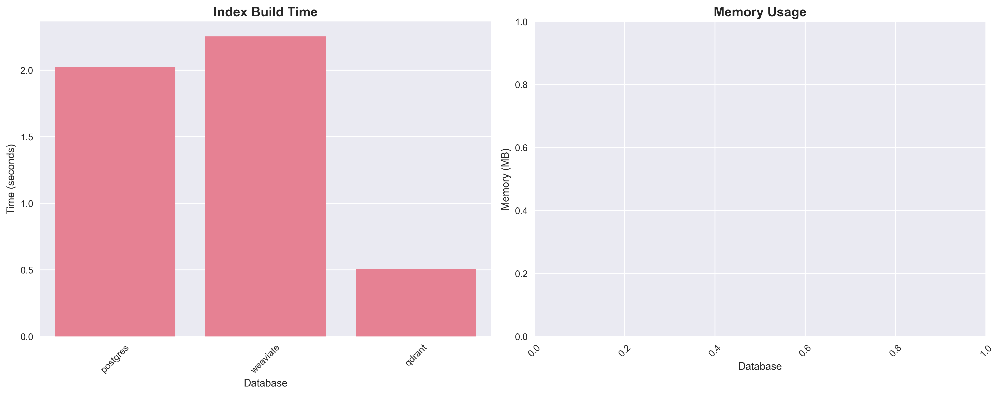
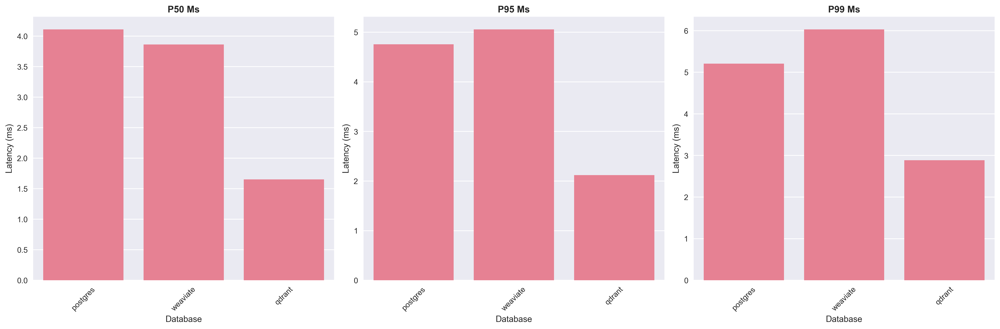
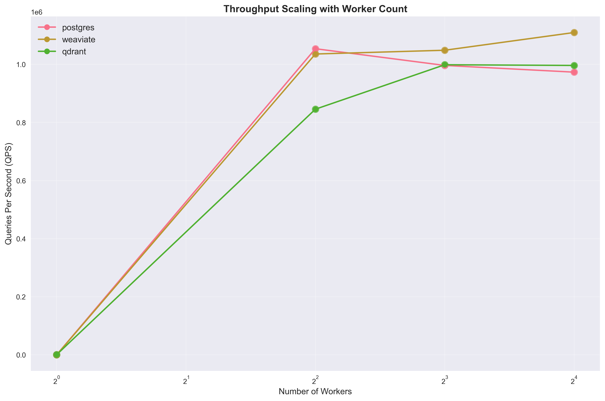
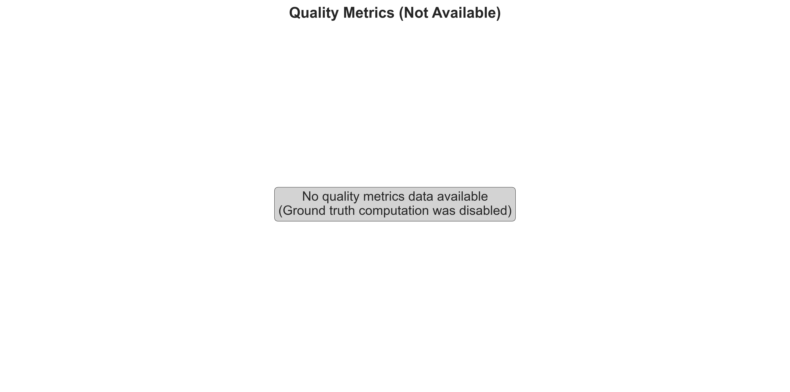
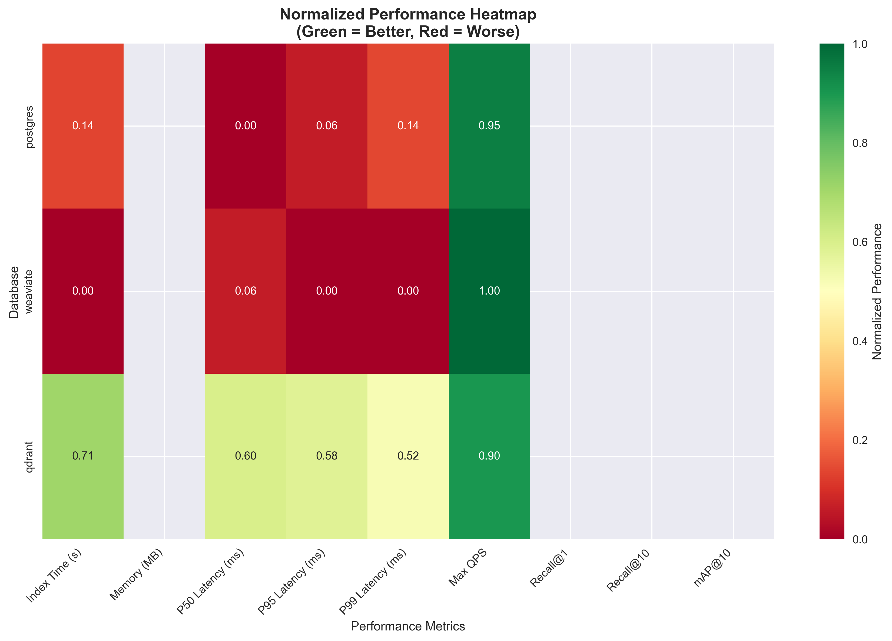
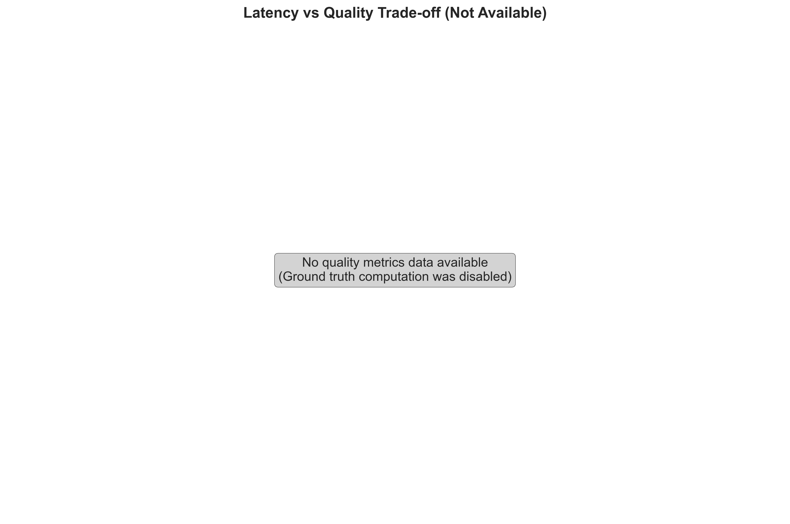

# Vector Database Comparison Benchmark

A comprehensive benchmark suite comparing **Postgres with pgvector**, **Weaviate**, and **Qdrant** on vector similarity search performance with real-world MS MARCO evaluation.

## 🚀 Quick Start

```bash
# Setup
docker-compose up -d
uv sync

# Run benchmark with MS MARCO evaluation
uv run benchmark --vectors 10000 --queries 100 --enable-evaluation

# Generate visualizations
uv run python visualize_results.py --show-plots
```

## 📊 Performance Results

### Index Build Times


### Latency Analysis


### Throughput Scaling


### Quality Metrics


### Performance Heatmap


### Latency vs Quality Trade-offs


## 🎯 Key Features

- **Real-world Evaluation**: MS MARCO dataset with ground truth extraction
- **Comprehensive Metrics**: Recall@K, MRR, latency percentiles, throughput scaling
- **Multi-threaded Testing**: 1, 4, 8, and 16 workers
- **Docker Integration**: One-command setup for all databases
- **Rich Visualizations**: Automated performance charts and heatmaps

## 📈 Databases Compared

| Database | Version | Vector Extension | Index Type |
|----------|---------|------------------|------------|
| PostgreSQL | 16 | pgvector | IVFFlat |
| Weaviate | 1.22.4 | Built-in | HNSW |
| Qdrant | 1.7.4 | Built-in | HNSW |

## 🛠️ Setup

### Prerequisites
- Python 3.9+
- Docker and Docker Compose
- UV package manager

### Installation
```bash
git clone https://github.com/Mahanteshambi/VectorDB_Comparison.git
cd VectorDB_Comparison
docker-compose up -d
uv sync
```

## 🚀 Usage

### Basic Benchmark
```bash
uv run benchmark
```

### MS MARCO Evaluation
```bash
uv run benchmark --vectors 10000 --queries 100 --enable-evaluation
```

### Generate Visualizations
```bash
# Save plots only
uv run python visualize_results.py

# Show and save plots
uv run python visualize_results.py --show-plots
```

### Parameters
- `--vectors`: Number of vectors to index (default: 100,000)
- `--queries`: Number of query vectors (default: 1,000)
- `--enable-evaluation`: Enable MS MARCO evaluation (default: False)
- `--use-ms-marco`: Use MS MARCO dataset (default: True)
- `--use-synthetic`: Use synthetic data instead

## 📊 Evaluation Metrics

### MS MARCO Ground Truth
- **Recall@K**: Measures relevant documents found in top-K results
- **MRR**: Mean Reciprocal Rank of first relevant document
- **Real-world Data**: Actual MS MARCO queries and passages

### Example Results
```
MS MARCO Evaluation:
  RECALL@1: 0.2000
  RECALL@5: 0.8000
  RECALL@10: 0.8000
  RECALL@20: 0.8000
  MRR: 0.4400
```

## 🏗️ Architecture

```
vdb_comparison/
├── benchmark.py              # Main benchmark script
├── data_management.py        # Vector generation and indexing
├── search_engines.py         # Database search implementations
├── metrics.py               # Performance calculations
├── evaluation.py            # MS MARCO evaluation
├── visualize_results.py     # Results visualization
└── plots/                   # Generated visualizations
```

## 📋 Results

The benchmark generates comprehensive results including:

- **Performance Metrics**: Latency (P50, P95, P99), throughput (QPS)
- **Quality Metrics**: Recall@K, mAP@K, NDCG
- **Resource Usage**: Index build time, memory consumption
- **Scaling Analysis**: Performance across different worker counts
- **Visualizations**: Automated charts and heatmaps

## 🔧 Development

### Project Structure
- **Modular Design**: Clean separation of concerns
- **Extensible**: Easy to add new databases or metrics
- **Reproducible**: Pinned versions and deterministic results
- **Well-tested**: Comprehensive error handling and validation

### Adding New Databases
1. Implement `VectorSearchEngine` interface in `search_engines.py`
2. Add database connection logic
3. Update `SearchEngineManager` to include new engine
4. Add to Docker Compose if needed

## 📄 License

This project is open source and available under the MIT License.

## 🤝 Contributing

Contributions are welcome! Please feel free to submit a Pull Request.

## 📞 Support

For questions or issues, please open an issue on GitHub.